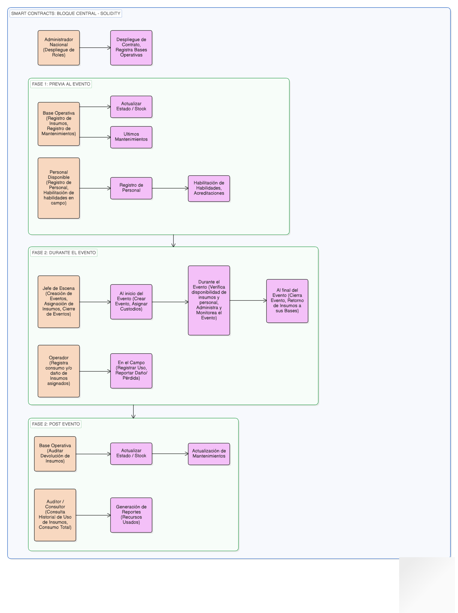
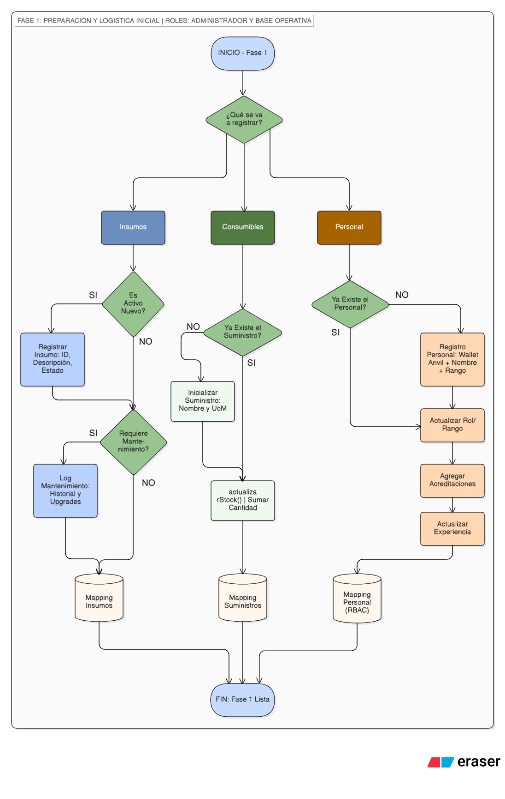
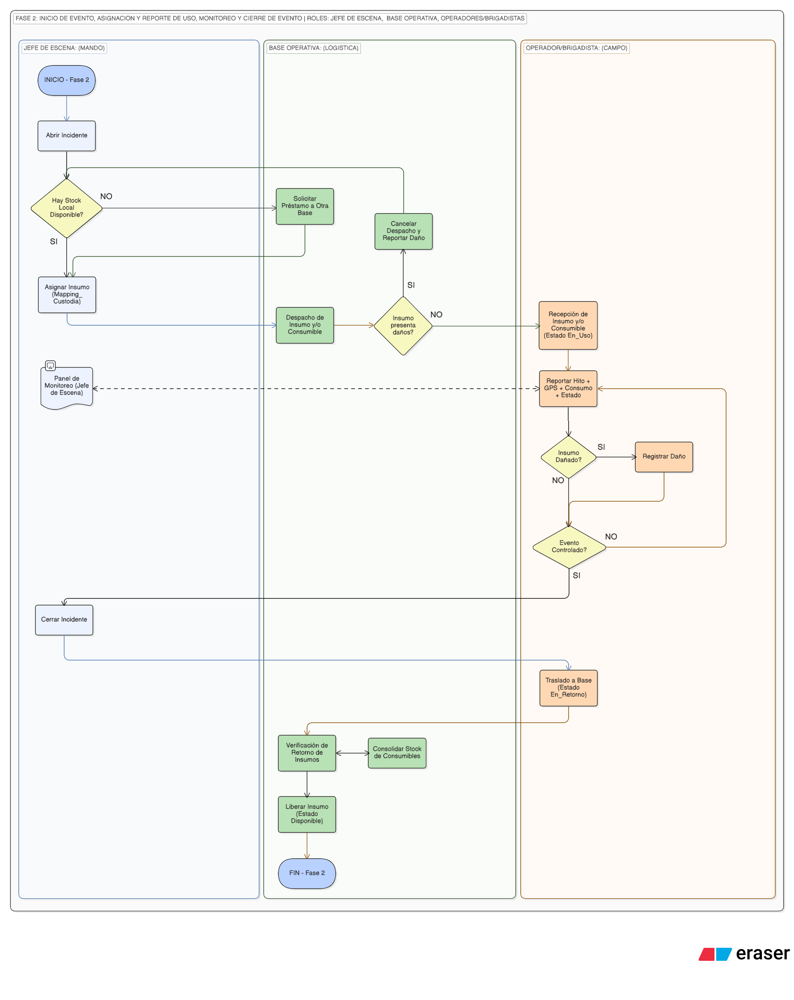
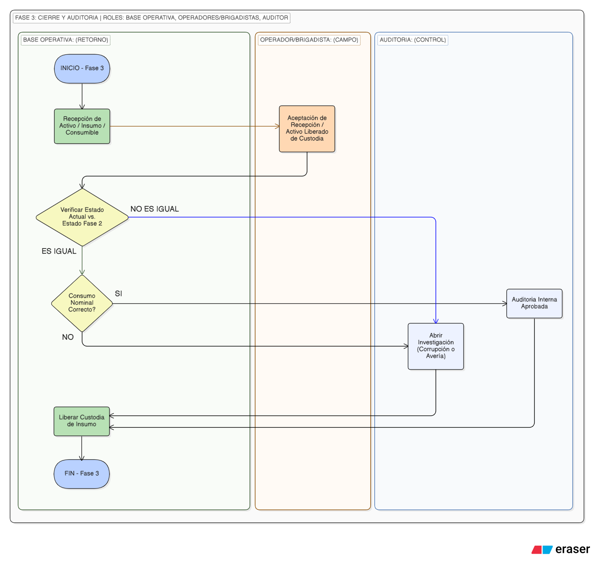

# 🔥 FireOPS: Trazabilidad Logística Global de Eventos y Equipamiento en Incendios Forestales

## 🎯 Objetivo

Esta es una Aplicación Descentralizada, diseñada para revolucionar la gestión logística y operativa en el combate de incendios, integrando la inmutabilidad de la tecnología Blockchain con la eficiencia de los Sistemas de Comando de Incidentes.

Desde la perspectiva organizacional, esta plataforma optimiza la respuesta ante emergencias al permitir un control dinámico y en tiempo real del ciclo de vida de los insumos (desde equipos grandes y costosos motobombas, pasando por equipos medianos como radios de comunicación, hasta equipos pequeños como los batefuegos), asegurando que cada recurso esté exactamente donde se necesita y bajo la custodia de personal calificado, reduciendo tiempos muertos y errores humanos en el despliegue de campo.

Desde la visión de transparencia e inmutabilidad, la plataforma actúa como un auditor digital insobornable; al registrar cada asignación, consumo y retorno de equipo en un registro distribuido, se elimina cualquier posibilidad de alteración de datos, combatiendo frontalmente la corrupción y el mal manejo de bienes y recursos. El resultado es una trazabilidad absoluta que no solo salva recursos, sino que fortalece la confianza institucional mediante una rendición de cuentas automatizada, transparente y auditable en todo momento.

## 📋 Definiciones Iniciales

### 1. 👥 Jerarquía de Actores (Roles)

Definir los roles es clave para asignar permisos (quién puede registrar qué). La siguiente es una propuesta de jerarquía con enfoque inicial en la operatividad que se tiene en Ecuador y puede crecer a una proyección global:

| Actor | Rol en la dApp | Ejemplo de Permisos |
| :--- | :--- | :--- |
| **Administrador Nacional** (Cuenta 0 Anvil) | `ADMIN_NACIONAL` | Despliega el contrato, registra Bases Operativas, Cambios de Roles. |
| **Bases Operativas** (Cuentas 1 y 2 Anvil) | `BASE_OPERATIVA` | Registra inventarios, reporta novedades, asigna Jefe de Escena, Gestión de personal. |
| **Jefe de Escena** (Cuentas 3 a 6 Anvil) | `JEFE_ESCENA` | Crea Eventos de Incendio, asigna recursos a las Brigadas, registra fases. |
| **Brigadista / Operador** (Cuentas 7 a 16 Anvil) | `OPERADOR` | Registra Uso/Pérdida de insumos, registra hitos de avance o daño. |
| **Verificador / Auditor** (Cuenta 17 y 18 Anvil) | `AUDITOR` | Solo consulta. Revisa cadena de eventos y rendición de cuentas. |
| **Público General** (Cuenta 19 Anvil) | `CONSULTOR` | Solo consulta. Verifica eventos y estado general de recursos. |

________________________________________

2.	Arquitectura de Seguridad y Gobernanza

•	Control de Acceso Granular: Se implementará el estándar AccessControl de OpenZeppelin. Esto permite trabajar con identificadores únicos (bytes32) que representan cada rol, haciendo que el sistema sea Dinámico. Si se necesita dar de baja a un Jefe de Escena o añadir un nuevo Auditor, el Administrador General puede hacerlo mediante una transacción, sin necesidad de modificar o volver a desplegar el código del contrato. Se desplegará Anvil indicándole que use 20 cuentas (opción –accounts 20) para poder tener un abanico más amplio de direcciones para la interacción.

[Tabla2: Comparación de Control de Acceso]
[Columnas: Característica, Con if (msg.sender == ...), Con AccessControl]
Escalabilidad, Limitada a una o pocas direcciones fijas., Permite cientos de direcciones por rol.
Seguridad, Riesgo de "Hardcoding" y errores manuales., Biblioteca auditada por la industria (OpenZeppelin).
Gobernanza, Estática (requiere actualizar contrato)., Dinámica (gestión de permisos en tiempo real).
Costo Gas, Variable según la complejidad del if., Optimizado mediante Hashing (keccak256).
[Fin de la Tabla2]

•	Pausa de Emergencia (Circuit Breaker): Se implementará el estándar Pausable. Este mecanismo permitirá al ADMIN_GENERAL detener temporalmente las funciones de escritura en el Smart Contract ante la detección de anomalías o fallos de infraestructura, asegurando que la integridad de los datos no se vea comprometida durante una incidencia.
•	Prevención de Reentrada: Se aplicará el modificador nonReentrant en funciones críticas de actualización de inventario y cierre de eventos. Con esto se evitarán ataques de llamadas recursivas que pudiesen intentar duplicar registros de devolución o manipular estados de insumos de forma concurrente.
•	Trazabilidad de Gobernanza (Audit Logs): Se definirá una arquitectura de eventos indexados que registrará cada cambio en la estructura de permisos. Mediante la emisión de eventos como RoleGranted y RoleRevoked, se facilitará una auditoría forense inmutable sobre quién otorgó o retiró facultades dentro de la plataforma.

3.	📝 Trazabilidad del Ciclo del Evento

El ciclo de un incendio se divide en tres fases principales que registrarán eventos inmutables en la blockchain.

3.1.	🚨 Fase Previa - Inventario, Mantenimiento y Medios disponibles (personal y equipamiento)

En esta fase, el enfoque es la gestión de activos. Se registra la vida útil y el mantenimiento de los insumos críticos.

•	Registro de Insumo Único (NFT/Token ID): Cada ítem se registra con un valor único como identificador y su respectivo mantenimiento
    o	Ejemplo de registro: [evento ASSET_REGISTRATION] La base 'Quito Central' da de alta: "Camión Cisterna Hino. ID: CC-001. Capacidad: 2000 galones. Año: 2024. Estado Inicial: Operativo"., La base 'Guayaquil' da de alta: "Motobomba Portátil. ID: MB-002. Presión: 150 PSI. Fabricante: Waterax. Estado Inicial: Operativo".

•	Eventos de Mantenimiento: Se registra la fecha y el resultado del último evento, como por ejemplo su última revisión o mantenimiento.
    o	Ejemplo de Evento: [evento MAINTENANCE_LOG] La base 'Quito Central' registra: "Reemplazo de batería de Radio Motorola ID-A123. Fecha: 2025-12-01. Operador: Pedro Álava."
    o	Ejemplo de Insumo: [evento INVENTORY_STATUS] La base 'Guayaquil' registra: "Stock de mangueras (3 pulgadas) actualizado a 50 unidades. Última reposición: 2025-11-20."

•	Registro de personal disponible: Para saber cuántas personas se tendrían disponibles para cualquier evento
    o	Ejemplo de registro de Personal: 
        - Contexto: Inicio de guardia en la Estación de Bomberos. El personal se "loguea" en la dApp con su Wallet institucional para quedar activo en el pool de despacho.

        - Datos Registrados en Blockchain:

            * ID Persona: Wallet_0x123...abc (Vinculada al ID de empleado).

            * Rol Táctico: Jefe de Cuadrilla / Motobombista / Paramédico.

            * Estado: DISPONIBLE (Green Status).

            * Certificaciones Activas: Curso CPIF (Combatiente de Incendios Forestales) - Vigente hasta 2026.

        - Acción de la dApp: Al momento de un despacho, el sistema filtra automáticamente: "Necesito 5 brigadistas que estén en estado 'Disponible' y tengan su certificación vigente".

        - Resultado: El Comandante de Incidentes ve en su Dashboard una lista de personal real, no teórica, evitando enviar a alguien que ya está en otra misión o que no tiene el reentrenamiento al día.

3.2.	🚒 Fase Durante (Combate y Asignación)

Aquí se registra la cadena de custodia de los insumos.

Pasos Clave del Evento de Incendio:

•	Creación del Evento (rol JEFE_ESCENA): Se registra el inicio del incidente: [ID-INC002], Coordenadas -0.1807, -78.4678, Nivel de Riesgo 4, Fecha y Hora de inicio.

•	Asignación de Recursos (rol JEFE_ESCENA): Se vinculan los insumos del inventario al evento y a la Brigada responsable.
    o	Ejemplo: [evento ASSIGNMENT_LOG] Jefe de Escena ID-JF05 asigna: "Camión Cisterna ID-CC007 + 5 radios ID-RF00x a Brigada 'Cóndor' (Líder de brigada: Juan Pérez)."

•	Registro de Uso y Consumo (rol OPERADOR): Los brigadistas registran el uso y el estado final de los insumos.
    o	Ejemplo: [evento CONSUMPTION_LOG] Operador ID-BG04 registra: "Consumo de 500 litros de líquido retardante del Cisterna ID-CC007. Hito: Línea de contención establecida al 50%."

3.3.	✅ Fase Post (Verificación y Rendición de Cuentas)

En esta fase se cierra el ciclo del incendio y se audita el estado final de los recursos.

•	Cierre del Evento (rol JEFE_ESCENA): Se registra la hora de control/extinción y el resumen de daños.

•	Auditoría de Insumos (rol BASE_OPERATIVA): Se verifica la devolución de los insumos asignados y su estado.
    o	Ejemplo: [evento AUDIT_LOG] Base Operativa verifica: "Radio ID-RF005 devuelto en estado 'Daño Menor'. Se requiere reemplazo de antena. Genera ticket de mantenimiento/reposición."

•	Reporte de Transparencia (rol AUDITOR/CONSULTOR): Se genera un resumen consultable por el público: "Incendio Forestal [ID-INC001]: Recursos asignados, Consumo total de agua/retardante,"
________________________________________

4.	💾 Estructuras Clave de Solidity (Smart Contract)

El contrato necesitará mapeos y estructuras para almacenar los datos de manera eficiente.

Estructuras de Datos:

// 1. Representación del Personal (Fase 1)
struct Personal {
    address billetera;      // Cuenta de Anvil (8-15 para Operadores)
    string nombre;
    string especialidad;    // Maquinista, Radio, Conductor, etc.
    bool estaActivo;        // Control administrativo de baja/alta
}

// 2. Gestión de Activos Físicos (Fase 1, 2 y 3)
struct Insumo {
    bytes32 codigoInventario; // ID único optimizado (ej: CC-001)
    string descripcion;
    address basePropietaria;  // Base que dio el alta (Cuentas 1-2)
    address custodioActual;   // address(0) si está en base, o la del Operador
    uint8 estado;             // 0: Disponible, 1: En Uso, 2: Taller, 3: Perdido
    uint8 estadoReportadoF2;  // Lo que el operador reportó en campo (Fase 2)
    uint256 ultimoMantenimiento;
}

// 3. Control del Incidente (Fase 2 y 3)
struct EventoIncendio {
    uint256 eventoID;
    address jefeDeEscena;     // Cuenta de Anvil (3-6)
    uint256 timestampInicio;
    uint256 timestampFin;
    string coordenadas;
    uint256 riesgo;           // Escala 1-5
    bool activo;              // True mientras no se cierre en Fase 3
}

// 4. Diario de Operaciones (Logs de Auditoría)
struct LogOperativo {
    uint256 eventoID;
    bytes32 codigoInsumo;
    address operador;         // Quién usó/reportó el equipo
    uint256 timestamp;
    string detalles;          // "Línea de contención al 50%", "Daño en manguera"
    bool esDiscrepancia;      // Marcador automático para el Auditor (Fase 3)
}
Mapeos de Almacenamiento:
[Tabla3: Mapeos]
[Columnas: Mapeo; Propósito Técnico]
mapping(bytes32 => Insumo) public inventario;	Permite consultar cualquier equipo instantáneamente usando su código (ID).
mapping(address => Personal) public brigadistas;	Vincula una dirección de billetera con el perfil técnico de la persona.
mapping(uint256 => EventoIncendio) public incendios;	Almacena los detalles generales de cada evento por su número de ID.
mapping(uint256 => LogOperativo[]) public bitacoraEvento;	Guarda una lista de todos los movimientos y reportes de un incendio específico.
mapping(address => bool) public basesAutorizadas;	Lista blanca de las cuentas de Anvil que pueden cargar inventario inicial.
[Fin de la Tabla3]

5.	 Diagrama de Bloques dApp Fuego Zero

 
6.	🏛️ Las Fases del Bloque Central:

6.1.	Fase 1: Previa (Inventario y Mantenimiento)

Se enfoca en la gestión de activos y la preparación, garantizando que todos los recursos que potencialmente se usarán en un incendio forestal estén documentados, localizados y en estado operativo verificado.

Establecer la cadena de origen de cada activo crítico, garantizando que su estado, ubicación y historial de servicio sean inmutables antes de su asignación a un evento de emergencia.

El Actor Principal: BASE_OPERATIVA: Este rol, típicamente asignado al jefe de logística o al comandante de la estación de bomberos, tiene el poder de escribir datos iniciales y de mantenimiento en el Smart Contract (SC). Es la persona que físicamente tiene la custodia y responsabilidad del equipo, y es la única con permisos para Registrar Insumos y Registrar Mantenimiento del Equipamiento que lo amerita.

Procesos Centrales: La Fase 1 se compone de dos procesos de escritura de datos esenciales: la creación del activo y su seguimiento periódico.

1.	Proceso de Creación: Registro de Nuevo Insumo

Este proceso ocurre una sola vez en la vida de un activo y le da un ID único en la Blockchain.

[Tabla 4: Proceso de Creación: Registro de Nuevo Insumo]
[Columnas: Elemento, Descripción, Función SC (Solidity), Impacto en SC]
Insumo Único, Equipos con trazabilidad individual y hoja de vida (Ej: Camión, Radio)., registrarInsumo(...), Crea un struct único con ID (bytes32) y estado inicial.
Suministros (Consumibles), Recursos que se gestionan por cantidad o volumen (Ej: Líquido retardante, mangueras)., inicializarSuministro(...), Crea una entrada en un mapeo de cantidades (mapping).
Gestión de Stock, Acción de actualizar las cantidades disponibles de suministros., actualizarStock(codigo, cantidad), Modifica el contador numérico (suma/resta) del suministro existente.
[Fin de la Tabla 4]

Ejemplo de Registro: La BASE_OPERATIVA firma una transacción para registrar un "Kit de Linterna Táctica ID-LT005" en estado "Disponible", con fecha de registro: año-mes-dia.

2.	Proceso de Seguimiento: Log de Mantenimiento

Este proceso es la prueba de que el equipo sigue siendo apto para el servicio y añade la trazabilidad del ciclo de vida del activo.

[Tabla 5: Proceso de Seguimiento: Log de Mantenimiento]
[Columnas: Elemento, Descripción, Función SC (Solidity), Impacto en SC]
Log de Mantenimiento, Registro de revisiones, reparaciones o reemplazo de piezas (Ej: Cambio de aceite motobomba)., logMantenimiento(codigo, detalles, nuevoEstado), Añade un nuevo evento al historial (array) del Insumo y actualiza su disponibilidad.
Actualización de Estado, Cambio en la operatividad del equipo tras la revisión., actualizarEstado(codigo, nuevoEstado), Modifica el campo estado en el struct del Insumo (Ej: de "Taller" a "OK").
Timestamp Técnico, Registro automático de la fecha y hora de la intervención., block.timestamp, Actualiza de forma inmutable el campo ultimoMantenimiento para futuras alertas.
[Fin de la Tabla 5]

Ejemplo de Mantenimiento: La BASE_OPERATIVA  registra: "Reemplazo de batería y calibración de antena en Radio ID-R15". La función actualiza el ultimoMantenimiento y cambia el estado a Disponible, permitiendo que el JEFE_ESCENA pueda asignarlo en la Fase 2.

3.	 Proceso de Gestión: Suministros y Stock (Consumibles)

A diferencia de los activos fijos, los suministros se gestionan por volumen. Este proceso garantiza que la base operativa tenga los recursos necesarios (agua, espuma, combustible) antes del despacho, permitiendo un control de inventario dinámico.

[Tabla 6: Proceso de Gestión: Suministros y Stock (Consumibles)]
[Columnas: Elemento, Descripción, Función SC (Solidity), Impacto en SC]
Definición de Suministro, Creación del catálogo de materiales consumibles y su unidad de medida., inicializarSuministro(nombre, UoM), Crea una entrada única en el mapeo de suministros con stock inicial cero.
Gestión de Stock, Carga inicial o reposición de cantidades físicas al inventario., actualizarStock(codigo, cantidad), Realiza una operación aritmética (suma) sobre el saldo existente del suministro.
Unidad de Medida (UoM), Estándar de métrica (Litros, Metros, PSI) para evitar errores de carga., Parámetro en inicializarSuministro, Define la constante con la que se realizarán los cálculos de consumo en la Fase 2.
[Fin de la Tabla 6]

4.	Proceso de Creación: Registro y Acreditación de Personal

Este proceso establece la identidad digital y operativa de cada interviniente. No solo registra quién es el usuario, sino que define sus capacidades legales y técnicas dentro de la emergencia mediante un sistema de Control de Acceso Basado en Roles (RBAC).

[Tabla 7: Proceso de Creación: Registro y Acreditación de Personal]
[Columnas: Elemento, Descripción, Función SC (Solidity), Impacto en SC]
Identidad Digital, Vinculación de la Wallet de Anvil con los datos del brigadista., registrarPersonal(wallet, nombre, rango), Crea un struct en el mapping de personal autorizado.
Acreditaciones, Carga de certificaciones, habilidades, cursos y experiencia técnica., añadirAcreditacion(wallet, certificado), Actualiza el array de habilidades permitiendo asignaciones críticas en Fase 2.
Rango Operativo, Nivel jerárquico que determina los permisos de escritura en el SC., actualizarRango(wallet, nuevoRango), Modifica los permisos de acceso (ej: subir de Brigadista a Jefe de Escena).
Historial de Campo, Registro dinámico de la veteranía y horas de combate del personal., actualizarExperiencia(wallet, horas, eventoID), Acumula métricas de desempeño inmutables para auditoría y asignación prioritaria.
[Fin de la Tabla 7]

5.	 Conexión Lógica con Fases Posteriores

La calidad de la data en la Fase 1 es lo que permite la rendición de cuentas en las fases 2 y 3.

•	Conexión con la Fase 2 (Durante): Un JEFE_ESCENA solo puede asignarInsumo(...) (Fase 2) si ese insumo existe en el registro de la Fase 1 y su estado no es "Fuera de Servicio".
•	Conexión con la Fase 3 (Post): El Estado de Retorno es registrado por la BASE_OPERATIVA al momento de recibir físicamente el insumo. El AUDITOR, genera un informe de discrepancias cruzando el estado inicial (Fase 1), los reportes de uso (Fase 2) y el estado final registrado (Fase 3).

🧱 Diagrama de Bloques: Flujo Operativo de la Fase 1

 
Esta fase, asegura la integridad de los datos desde el origen. Si tienes este inventario bien trazado en la Blockchain, cualquier uso o pérdida posterior será irrefutablemente documentado.

🚒 Fase 2: Durante (Asignación y Combate)

🎯 Objetivo Principal

Registrar en tiempo real (o diferido pero inmutable) qué se está usando, quién lo tiene y cuál es el avance del combate, vinculando los recursos de la Fase 1 con un incidente específico.

1. Actores

•	Jefe de Escena (JEFE_ESCENA): Es el "Director de Orquesta". Abre el evento, solicita recursos y los asigna. Su firma en la dApp valida que el recurso entró a la zona caliente.
•	Operador/Brigadista (OPERADOR): Es quien está en la línea de fuego. Reporta si una batería se agotó, si una herramienta se rompió o si el consumo de agua fue de "X" litros.

2. Procesos Centrales y su Impacto en la Blockchain

La Fase 2 transforma el estado estático del inventario en un flujo dinámico de eventos. Se compone de dos procesos críticos: la gestión del evento y la trazabilidad de la custodia.

A. Proceso de Gestión del Incidente: Creación y Cierre de Evento

Este proceso permite al Jefe de Escena activar la logística de emergencia. Sin un evento abierto, no se pueden asignar recursos, lo que evita el uso no autorizado de activos.

[Tabla 8: Proceso de Gestión del Incidente: Creación y Cierre de Evento]
[Columnas: Elemento, Descripción, Función SC (Solidity), Impacto en SC]
Apertura de Incidente, Creación de un nuevo EventoID con datos iniciales de ubicación., abrirEventoIncendio(...), Genera el ancla lógica para toda la trazabilidad de la Fase 2.
Validación de Actividad, Control de escritura que impide registrar datos en eventos cerrados., require(evento.estado == Activo), Seguridad: Bloquea funciones de gasto (Fase 2) una vez terminada la misión.
Cierre de Incidente, Finalización táctica y bloqueo de registros de consumo., cerrarIncidente(eventoID), Cambia el evento a Finalizado y los activos a En Retorno.
Estado "En Retorno", Fase intermedia del activo donde no se permite el gasto de suministros., estado = EnRetorno, Control: Impide el "gasto fantasma" de retardante/agua durante el viaje a base.
Recepción y Liberación, Confirmación física en Base Operativa y retorno a inventario., retornarInsumo(codigo, estado), El activo vuelve a estar Disponible y se libera de su vinculación al Evento anterior.
[Fin de la Tabla 8]

Ejemplo de Inicio de Incidente: El JEFE_ESCENA en el sector "Pasochoa" registra: Evento ID-101, Coordenadas: -0.45, -78.49, Riesgo: Nivel 4 (Alto), Fecha y Hora del Inicio del Evento.

Ejemplo de cierre de Incidente:
•	Acción: El Jefe de Escena cierra el Evento ID-101.
•	Efecto Inmediato: El Camión-01 pasa automáticamente de estado “En Uso” a estado “En Retorno”.
•	Intento de Fraude: Si alguien intenta registrar que se gastaron 50 galones de espuma retardante en el camino a la Base Operativa usando el ID-101, el Smart Contract lanzará el error: "Transacción Rechazada: Activo en Retorno".
•	Cierre Total: Solo cuando el Camión llega a la Base Operativa, se verifica el Insumo, su gasto/remanente y se ejecuta la función retornarInsumo, el camión queda libre, con estado “Disponible”.

B. Proceso de Trazabilidad: Asignación y Reporte de Uso

Este es el proceso más dinámico, donde los insumos de la Fase 1 se vinculan a personas y acciones.

[Tabla 9: Proceso de Trazabilidad: Asignación y Reporte de Uso]
[Columnas: Elemento, Descripción, Función SC (Solidity), Impacto en SC]
Consulta de Disponibilidad, Verificación de stock local y posibilidad de préstamo inter-base., consultarStock(idBase), Filtro: Si no hay stock, dispara solicitud de transferencia a Base 2.
Asignación de Activo, Vinculación de un equipo a un evento y un brigadista., asignarInsumo(eventoID, codigo, operador), Cambia el estado a "En Uso" para bloquearlo para otros eventos, y actualiza el custodioActual.
Despacho de Suministro, Salida física de consumibles desde la base hacia la escena., despacharSuministro(eventoID, idSum, cant), Inventario: Descuenta del stock global y lo asigna como costo al incidente.
Check-in de Operador, Firma digital del brigadista confirmando la recepción digital y  física., confirmarRecepcion(codigo), Cambio de Custodia: El estado pasa de "Asignado" a "En Uso".
Reporte de Hito Consolidado, Registro periódico de: Estado Fuego + Consumo + Coordenadas GPS., registrarHito(eventoID, consumo, gps, estadoFuego), Inmutabilidad: Crea una línea de tiempo técnica y situacional (Dashboard).
Validación de Integridad, Reporte de daños en combate que cambia el estado del activo., reportarDano(codigo, detalle), Alerta: Si se marca como "Dañado", se notifica a la Base para reemplazo.
Bloqueo por Control, Cierre del flujo de gasto una vez controlado el incendio por el Jefe., cerrarIncidente(eventoID), Seguridad: El evento pasa a Finalizado y los activos a "En Retorno".
Verificación de Retorno, Validación final de la Base Operativa (Físico vs Digital) al recibir equipo., retornarInsumo(codigo, estadoFinal), Liberación: El activo vuelve a estar "Disponible" para la Fase 1.
[Fin de la Tabla 9]

Ejemplo 1: Asignación de Activo Fijo y Suministro Inicial

•	Contexto: Se despliega el Camión Cisterna ID-CC001 al Incendio ID-INC101.
•	Acción: El Jefe de Escena ejecuta asignarInsumo(ID-INC101, "ID-CC001", 0xBrigadista9). Adicionalmente, se registran 200 galones de retardante vía despacharSuministro.
•	Resultado en Blockchain: * Activo: El ID-CC001 queda bloqueado para otros eventos y marcado como "En Uso".
    * Suministro: El stock en la Base Operativa baja automáticamente de 1000 a 800 galones.

Ejemplo 2: Intento de Despliegue de Radio Averiada

•	Contexto: En la Fase 1, la Radio ID-RF045 fue marcada como "En Mantenimiento" tras una falla en la batería. El Jefe de Escena intenta asignársela al Brigadista7 para el Incendio ID-INC101.
•	Acción: El sistema intenta ejecutar asignarInsumo(ID-INC101, "ID-R45", 0xBrigadista7).
•	Resultado en Blockchain: TRANSACCIÓN REVERTIDA. El Smart Contract detecta que el estado no es "Disponible" y lanza el error: REVERT: Equipo ID-RF045 fuera de servicio por mantenimiento. La radio no puede salir de la base en el sistema.

Ejemplo 3: Control de "Gasto Fantasma" en el Cierre

•	Contexto: El incendio se declara controlado. El equipo debe volver a la base.
•	Acción: Se ejecuta cerrarIncidente(ID-INC101). Esto activa automáticamente el estado "En Retorno" para el Camión ID-CC001.
•	Intento de Desviación: Si un usuario intenta registrar un consumo de 20 galones de combustible extra usando el ID-INC101 mientras el camión viaja a la base, el Smart Contract rechaza la transacción con el error: "Error: Activo en estado de Retorno - Gasto No Permitido".
•	Resultado: Se garantiza que el retardante sobrante llegue físicamente a la base para su re-ingreso al inventario.

Ejemplo 4: Recepción y Liberación Final

•	Contexto: El Camión ID-CC001 llega a la Base Operativa.
•	Acción: El operador de base ejecuta retornarInsumo("ID-CC001", "Disponible").
•	Resultado en Blockchain: El activo se desvincula del Incendio 101. El custodio vuelve a ser "Base Central" y el equipo queda habilitado para ser asignado al Incendio 102 o a cualquier otro que se encuentre activo.

2.	Componentes Críticos del Flujo

Para garantizar que la trazabilidad sea absoluta y "a prueba de errores humanos", el flujo se apoya en los siguientes pilares lógicos:

•	El Evento (ID Único): No se permite la salida de ningún recurso (activo o suministro) si no existe un EventoID activo en la Blockchain. Esto elimina el uso discrecional de bienes públicos y justifica cada movimiento logístico bajo un incidente real.

•	Gestión Dinámica de la Custodia: La responsabilidad legal se transfiere en tiempo real. Al ejecutar asignarInsumo, el estado cambia de "Disponible" a "En Uso", vinculando la billetera digital (Wallet) del operador al código del activo. En caso de pérdida o daño, la Blockchain señala al responsable sin ambigüedades.

•	Estado de Protección "En Retorno": Este es un componente de seguridad logística que bloquea la función de consumo de suministros una vez que el incidente se marca como finalizado. Evita que los activos (ej. camiones cisterna) sufran "pérdidas misteriosas" de carga o combustible durante el trayecto de vuelta a la base.

•	Filtros de Integridad Pre-Despliegue (Fail-Safe): El Smart Contract actúa como un auditor de seguridad al integrar la validación require(estado == Disponible). Si un equipo fue marcado como "Dañado" o "En Mantenimiento" en la Fase 1, el sistema bloquea automáticamente su salida, protegiendo la integridad física de los brigadistas.

•	Inmutabilidad de Hitos y Consumos: Cada reporte de uso o hito de control del fuego queda grabado con una marca de tiempo (Timestamp) inalterable. Esto genera una línea de tiempo técnica que sirve como evidencia legal y operativa para las auditorías de la Fase 3.
________________________________________

🧱 Diagrama de Bloques: Flujo Operativo de la Fase 2

Aquí visualizamos las decisiones que toma el Jefe de Escena, la Base Operativa y el Operador/Brigadista:

El Panel de Monitoreo para el Jefe de Escena, es un desarrollo opcional en HTML y CSS (revisar el archivo panel_de_control.html) que se encuentra en la carpeta "Documentacion". En su momento se tomará en cuenta para incluirlo como parte del presente proyecto.

🏗️ Fase 3: Post (Auditoría, Recepción y Rendición de Cuentas)

En esta fase, se verifica el estado final de los activos, mostrando la capacidad de la Blockchain para realizar auditorías de estados previos.

🎯 Objetivo Principal

Cerrar la cadena de custodia, reintegrar los equipos al inventario (Fase 1) y que estén disponibles en cualquier evento en curso (Fase 2), y generar un reporte de transparencia inmutable sobre el costo y recursos del combate.

1. Actor Principal: AUDITOR / BASE_OPERATIVA

En esta fase, la Base Operativa recupera su rol protagónico para recibir el equipo, pero entra en juego el Auditor para validar que lo que salió coincida con lo que regresó.

2. Procesos Centrales y su Impacto en la Blockchain (Fase 3)

La Fase 3 evalua el estado del inventario posterior a un evento. Se compone de dos procesos críticos: la recepción y reintegro, y la rendición de cuentas.

A. Proceso de Retorno y Cierre Operativo

Es el proceso inverso a la asignación. El equipo deja de estar vinculado al evento y regresa a la base.

En la siguiente tabla se describe cómo el activo vuelve a estar "Disponible" y cómo se detectan las fallas de último momento.

[Tabla 10: Proceso de Retorno y Cierre Operativo]
[Columnas:] Elemento | Descripción | Función SC (Solidity) | Impacto en SC |
| Verificación de Retorno | Validación final de la Base Operativa (Físico vs Digital) al recibir equipo. | retornarInsumo(codigo, estadoFinal) | Liberación: El activo vuelve a estar "Disponible" para la Fase 1. |
| Registro de Discrepancia | Alerta automática si el estado reportado en campo no coincide con el recibido. | registrarDiscrepancia(codigo, motivo) | Bloqueo: Envía el activo a revisión técnica y genera una alerta administrativa. |
| Ticket de Taller (Automático) | Si el equipo llega dañado, se bloquea para el próximo evento. | marcarReparacion(codigo) | Bloqueo: El estado pasa a "En Mantenimiento" (No disponible en Fase 2). |
| Conciliación de Consumos | Cruce de datos entre el reporte de hito del operador y el remanente físico. | conciliarConsumo(eventoID, idSum, cant) | Auditoría: Detecta "gastos fantasma" o pérdidas no reportadas de suministros. |
| Reintegro al Stock | El activo operativo se marca como disponible para un nuevo incidente. | actualizarEstado(codigo, Disponible) | Ciclo: El activo vuelve a aparecer en las consultas de la Fase 1. |
| Liberación de Custodia | Fin de la responsabilidad legal del brigadista sobre el equipo. | actualizarEstado(codigo, Disponible) | Ciclo: El activo vuelve a aparecer en las consultas de la Fase 1. |

Ejemplo 1: Retorno Exitoso y Reintegro (Flujo Ideal)

•	Contexto: El Incendio "Laderas del Pichincha ID-INC003" ha sido controlado. El Brigadista número 4 retorna a la base con la Radio ID-RF010.
•	Acción en la dApp: La Base Operativa recibe el equipo y ejecuta la función retornarInsumo(ID-RF010, Operativo). El sistema verifica que el reporte de hito en la Fase 2 también fue "Operativo".
•	Resultado Final:
    o	Se ejecuta insumo.custodio = address(0), liberando la responsabilidad legal del brigadista.
    o	El estado del activo cambia automáticamente a "Disponible".
    o	La Radio ID-RF010 aparece instantáneamente en el inventario de la Fase 1 para el siguiente turno.

Ejemplo 2: Detección de Discrepancia y Bloqueo (Flujo de Control)

•	Contexto: Durante el combate, el Operador de la Motobomba ID-MB005 sufrió un golpe en el chasis, pero no lo reportó en sus hitos de la Fase 2 por descuido.
•	Acción en la dApp: Al recibir el equipo, la Base Operativa detecta el daño físico y marca el estado como "Dañado". El Smart Contract detecta que el último estado reportado en campo fue "Operativo".
•	Resultado Final:
    o	Se dispara la función registrarDiscrepancia(ID-MB005, "Daño físico no reportado en Fase 2").
    o	El sistema emite una Alerta Administrativa vinculada a la Wallet del Operador.
    o	Se genera automáticamente un Ticket de Taller (marcarReparacion), bloqueando la motobomba en la dApp hasta que un técnico firme su reparación.

Ejemplo 3: Conciliación de Suministros (Consumibles)

•	Contexto: El Camión cisterna ID-CC004 regresa a la base tras despachar retardante en el incendio.
•	Acción en la dApp: La Base Operativa mide el remanente físico (20 galones) y lo ingresa en conciliarConsumo(ID-INC001, Retardante, 20). El sistema compara esto con los 100 galones despachados inicialmente y los 80 galones que el Jefe de Escena reportó como usados.
•	Resultado Final:
    o	Al coincidir los valores (100 - 80 = 20), el Auditor recibe un Check Verde de consistencia.
    o	El consumo queda sellado en el getReporteEvento, impidiendo que se alteren las cifras de gasto de recursos químicos posteriormente.

B. Proceso de Rendición de Cuentas (Transparencia)

Es la consolidación de toda la "huella digital" del incendio y todos los parámetros que se utilizarán para la rendición de cuentas.

[Tabla 11: Proceso de Rendición de Cuentas]
[Columnas:] Elemento | Descripción | Función SC (Solidity) | Impacto en SC |
| :--- | :--- | :--- | :--- |
| Reporte de Consumo Total | Suma automática de todos los LogUso y suministros del evento. | getReporteEvento(eventoID) | Consolidación: Genera un resumen final de gastos para auditoría de costos. |
| Certificado de Uso (Historial) | Trazabilidad completa de un insumo específico (quién lo tuvo y qué le pasó). | getCertificadoUso(codigo) | Inmutabilidad: Documento digital (NFT o Hash) que certifica el ciclo de vida del equipo. |
| Log de Telemetría Táctica | Consolidado de los hitos con Timestamp y coordenadas GPS reportadas. | getLogTactico(eventoID) | Evidencia: Prueba fehaciente de la ubicación y avance del personal en el terreno. |
| Sello de Auditoría Final | Firma digital del Auditor que bloquea el evento para siempre. | finalizarAuditoria(eventoID) | Seguridad Post-Cierre: Impide cualquier alteración de datos tras la revisión oficial. |
| Verificación de Integridad | Validación de que los hashes de los reportes coincidan con los datos en cadena. | checkIntegrity(eventoID) | Anti-Fraude: Asegura que nadie manipuló la base de datos externa (si la hubiere). |

Ejemplo 1: Auditoría de Gestión de Recursos (Post-Incidente)

•	Contexto: Un ente de control gubernamental solicita un informe detallado sobre el uso de recursos químicos (retardante) en el "Incendio Sector Norte".
•	Acción del Auditor: Ejecuta la función getReporteEvento(Evento_Norte). El sistema genera instantáneamente un resumen que suma todos los despachos de la Base y los consumos reportados por los brigadistas en sus hitos.
•	Resultado de Transparencia: * El reporte muestra un Hash único (Huella Digital).
    o	Si alguien intentara cambiar una cifra de consumo en la base de datos tradicional para ocultar un faltante, el Hash ya no coincidiría con el registro en la Blockchain, alertando inmediatamente sobre un intento de fraude.
    o	El Auditor emite el Sello de Auditoría Final, archivando el caso con datos inalterables.

Ejemplo 2: Certificación de Historial de Activo (Hoja de Vida Digital del Activo)

•	Contexto: Se planea dar de baja un lote de Radios ID-RF010 al ID-RF-056 y se necesita saber si su desgaste justifica la reposición o si hubo mal uso.
•	Acción del Consultor/Auditor: Consulta el getCertificadoUso(ID-RF010), getCertificaduUso(ID-RF011), etc.
•	Resultado de Transparencia: * La dApp despliega toda la "vida" del equipo: cuántos incendios atendió, quiénes fueron sus custodios, cuántas veces fue a taller por el marcarReparacion y qué coordenadas GPS reportó en su último servicio (Log de Telemetría).
    o	Este nivel de detalle permite una toma de decisiones basada en evidencia, eliminando el favoritismo o las compras innecesarias de equipo.

Ejemplo 3: Detección de Anomalías de Consumo y Diagnóstico de Causa Raíz

•	Contexto: Liquidación del "Incendio Sector Sur". El Camión Cisterna ID-CC004 despachó 500 galones. Tiempo operativo en la Blockchain: 3 horas.
•	Parámetro Base (Fase 1): Consumo Nominal Máximo de 60 galones/hora. (Total teórico máximo para el evento: 180 galones).
•	Acción en la dApp: El Auditor ejecuta getReporteEvento(ID_INC009). El sistema detecta que el Operador reportó un consumo de 450 galones, excediendo en 270 galones la capacidad física nominal de la bomba.
•	Resultado del Informe Final (Análisis Multicriterio):
    o	El sistema genera una Alerta de Desviación Técnica.
    o	El Auditor redacta un informe exigiendo una inspección dual:
        1.	Investigación Administrativa: Para descartar posibles actos de corrupción o malversación de insumos por parte de los custodios.
        2.	Peritaje Técnico: Para determinar si existió una avería en la operación del equipo (ej. fuga en válvulas o falla en el sistema de mezcla) que justifique la pérdida del retardante.

🧱 Diagrama de Bloques: Flujo Operativo Fase 3

 
📝 Explicación de la Lógica de Control en la Fase 3

En esta etapa, los nodos de decisión no son simples filtros de paso, sino mecanismos de auditoría automatizada que confrontan la realidad física del retorno con la memoria inmutable grabada en las fases anteriores.

1. Verificación de Integridad de Estado (Estado Actual vs. Fase 2)

Este es el primer filtro de seguridad de la dApp. El sistema compara el estado reportado por la Base Operativa al recibir el equipo frente al último hito de control registrado en la Fase 2.
•	Si NO ES IGUAL: Se detecta una inconsistencia física (ej. un equipo roto que se reportó como operativo en campo). El flujo se desvía inmediatamente al bloque "Abrir Investigación", vinculando permanentemente la Wallet del Operador responsable a una Alerta de Discrepancia.
•	Si ES IGUAL: El sistema valida la honestidad y diligencia del personal en el reporte de novedades y permite avanzar al siguiente control técnico.

2. Validación de Consumo Nominal (Filtro de Eficiencia Técnica)

Para los insumos que aplique (como motobombas o cisternas), el Smart Contract ejecuta un cálculo en tiempo real: (Tiempo de operación × Consumo nominal pre-registrado).

•	Resultado SI (Correcto): El consumo reportado es físicamente posible. El Auditor procede a la "Auditoria Interna Aprobada", lo que dispara la liberación total del activo.
•	Resultado NO (Anomalía): Se detecta un consumo excesivo que no coincide con la capacidad técnica del equipo. El sistema deriva el caso al bloque de "Investigación" para determinar si existen posibles actos de corrupción o una avería técnica no detectada.

3. Resolución y Destino Final del Activo

Tras la intervención del Auditor (ya sea por flujo regular o por investigación), el sistema determina el destino del bien en la Blockchain para cerrar el ciclo:

•	Liberación de Custodia (Paz y Salvo): Se ejecuta la función insumo.custodio = address(0), extinguiendo la responsabilidad legal del brigadista sobre el recurso.
•	Reintegro al Stock (Estado = Disponible): El activo vuelve a la "percha virtual", apareciendo nuevamente como elegible en la Fase 1 para el siguiente despacho.
•	Bloqueo por Excepción (Estado = Mantenimiento/Investigación): Si el resultado de la investigación arroja una falla técnica o mal uso, el activo queda bloqueado en la dApp. Esto obliga a que el proceso regrese a la Fase 1 para su reparación certificada o reposición, impidiendo que un equipo no apto salga a una nueva emergencia.

